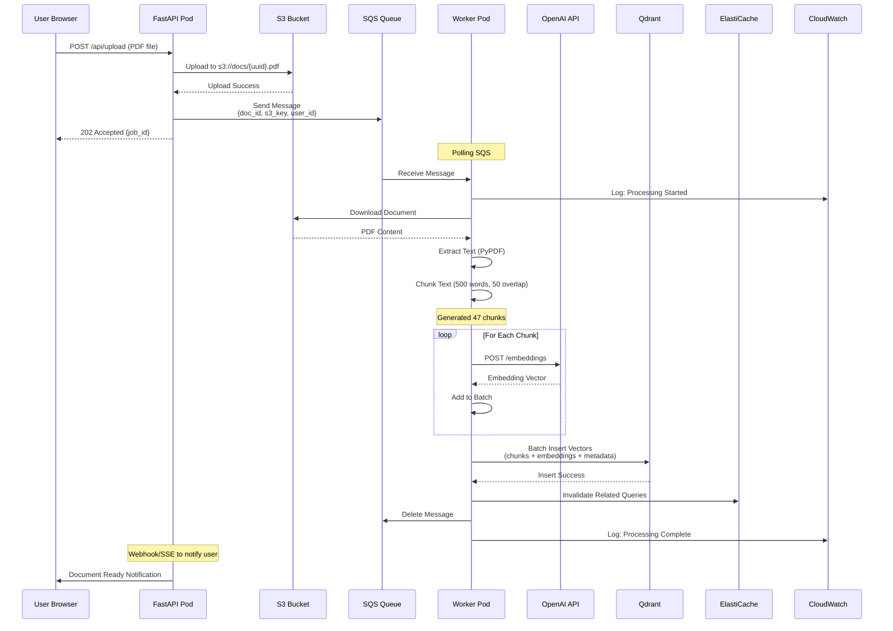

# RAG Production Architecture on AWS

High-level design for a production-grade RAG system on AWS with chatbot interface, Kubernetes orchestration, and comprehensive monitoring.

---

## Table of Contents

- [Architecture Overview](#architecture-overview)
- [Network Architecture](#network-architecture)
- [Component Details](#component-details)
- [Data Flow](#data-flow)
- [Monitoring & Observability](#monitoring--observability)
- [Security](#security)
- [Scalability](#scalability)
- [Cost Estimates](#cost-estimates)

---

## Architecture Overview

### High-Level Architecture

---

## Network Architecture

### VPC & Subnet Design

---

## Component Details

### EKS Cluster Architecture

---

## Data Flow

### Query Flow (User Question)

### Document Ingestion Flow

---

## Monitoring & Observability

### Monitoring Stack

### Key Metrics to Monitor

---

## Security

### Security Layers

### Data Flow Security

---

## Scalability

### Auto-Scaling Strategy

### Traffic Patterns & Capacity

---

## Cost Estimates

### Monthly Infrastructure Costs (Production)

```mermaid
graph TB
    subgraph "Compute Costs"
        EKS[EKS Control Plane<br/>$73/month<br/>per cluster]
        
        Nodes[EC2 Worker Nodes<br/>8 nodes average<br/>~$800/month]
        
        NAT[NAT Gateway<br/>3 AZs × $32<br/>~$96/month]
    end
    
    subgraph "Storage & Database"
        EBS[EBS Volumes<br/>300GB gp3<br/>~$24/month]
        
        S3[S3 Storage<br/>500GB Standard<br/>~$12/month]
        
        Redis[ElastiCache Redis<br/>cache.r6g.large + replicas<br/>~$200/month]
    end
    
    subgraph "Networking"
        ALB_Cost[Application Load Balancer<br/>~$25/month + $0.008/LCU-hour<br/>~$50/month total]
        
        DataTransfer[Data Transfer Out<br/>~$90/GB<br/>~$45/month]
    end
    
    subgraph "Monitoring & Logging"
        CW[CloudWatch<br/>Logs + Metrics<br/>~$30/month]
        
        XRay_Cost[X-Ray<br/>~$5/month]
    end
    
    subgraph "API Costs"
        OpenAI_Cost[OpenAI API<br/>Depends on Usage<br/>~$200-500/month]
        
        Bedrock_Cost[AWS Bedrock<br/>Fallback Only<br/>~$50/month]
    end
    
    Total[Total Monthly Cost<br/>Infrastructure: ~$1,400<br/>APIs: ~$250-550<br/>TOTAL: ~$1,650-1,950]
    
    EKS & Nodes & NAT --> Total
    EBS & S3 & Redis --> Total
    ALB_Cost & DataTransfer --> Total
    CW & XRay_Cost --> Total
    OpenAI_Cost & Bedrock_Cost --> Total
    
    style Total fill:#ff9900
```

### Cost Optimization Strategies

---

## Deployment Strategy

### CI/CD Pipeline

---

## Disaster Recovery

### Backup Strategy

---

## Summary

### Architecture Highlights

| Component | Technology | Purpose | Redundancy |
|-----------|-----------|---------|------------|
| **Frontend** | React on S3 + CloudFront | User Interface | Multi-AZ CDN |
| **API Gateway** | Application Load Balancer | Traffic Distribution | Multi-AZ |
| **API Layer** | FastAPI on EKS | Business Logic | 3-20 pods (auto-scale) |
| **Vector Database** | Qdrant on EKS | Semantic Search | 3-6 pods (replicated) |
| **Cache** | ElastiCache Redis | Query & Embedding Cache | Primary + 2 replicas |
| **Message Queue** | SQS | Async Processing | Managed, Multi-AZ |
| **Storage** | S3 | Document Storage | 99.999999999% durability |
| **Monitoring** | Prometheus + Grafana | Metrics & Alerts | Persistent storage |
| **Logging** | CloudWatch Logs | Centralized Logging | Managed |
| **Tracing** | AWS X-Ray | Distributed Tracing | Managed |

### Performance Targets

| Metric | Target | Notes |
|--------|--------|-------|
| **API Latency (p95)** | < 2 seconds | Including LLM call |
| **API Latency (p99)** | < 5 seconds | Cold cache scenario |
| **Cache Hit Rate** | > 60% | For similar queries |
| **Vector Search** | < 100ms | Within Qdrant |
| **Availability** | 99.9% | ~8.76 hours downtime/year |
| **Document Processing** | < 5 minutes | For 100-page PDF |

### Scalability Targets

| Metric | Current | Scale Target |
|--------|---------|--------------|
| **Concurrent Users** | 100-500 | 5,000+ |
| **Requests/Second** | 100 | 1,000+ |
| **Documents** | 10,000 | 1,000,000+ |
| **Vector Dimension** | 1,536 | 3,072 (if needed) |
| **Storage** | 100GB | 10TB+ |

---

## Next Steps for Implementation

1. **Phase 1: Foundation (Week 1-2)**
   - Set up VPC, subnets, security groups
   - Deploy EKS cluster
   - Set up ECR and GitLab CI/CD

2. **Phase 2: Core Services (Week 3-4)**
   - Deploy FastAPI application
   - Deploy Qdrant cluster
   - Set up ElastiCache
   - Configure S3 and SQS

3. **Phase 3: Monitoring (Week 5)**
   - Deploy Prometheus and Grafana
   - Configure CloudWatch integration
   - Set up alerting rules

4. **Phase 4: Frontend (Week 6)**
   - Deploy React application
   - Configure CloudFront
   - Set up Cognito authentication

5. **Phase 5: Testing & Optimization (Week 7-8)**
   - Load testing
   - Performance tuning
   - Cost optimization
   - Security hardening

6. **Phase 6: Production Readiness (Week 9-10)**
   - DR testing
   - Documentation
   - Team training
   - Go-live checklist

---

## Additional Resources

- **Terraform Modules**: Infrastructure as Code for all components
- **Kubernetes Manifests**: Deployment configs for all services
- **Monitoring Dashboards**: Pre-built Grafana dashboards
- **Runbooks**: Operational procedures for common scenarios
- **API Documentation**: OpenAPI/Swagger specs

---

**Document Version:** 1.0  
**Last Updated:** January 2026  
**Owner:** Platform Engineering Team